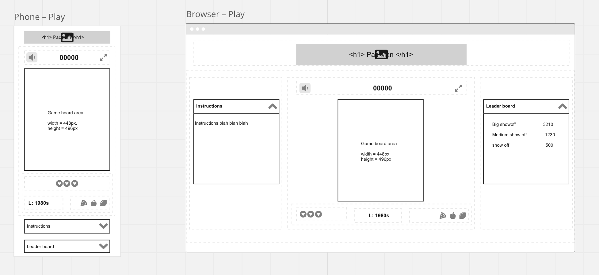
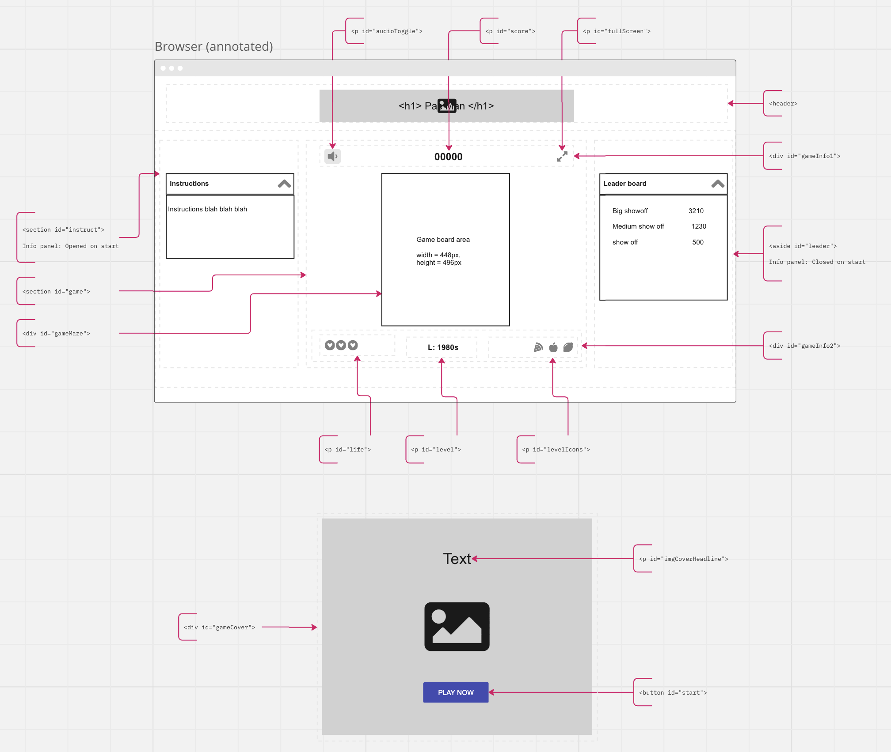
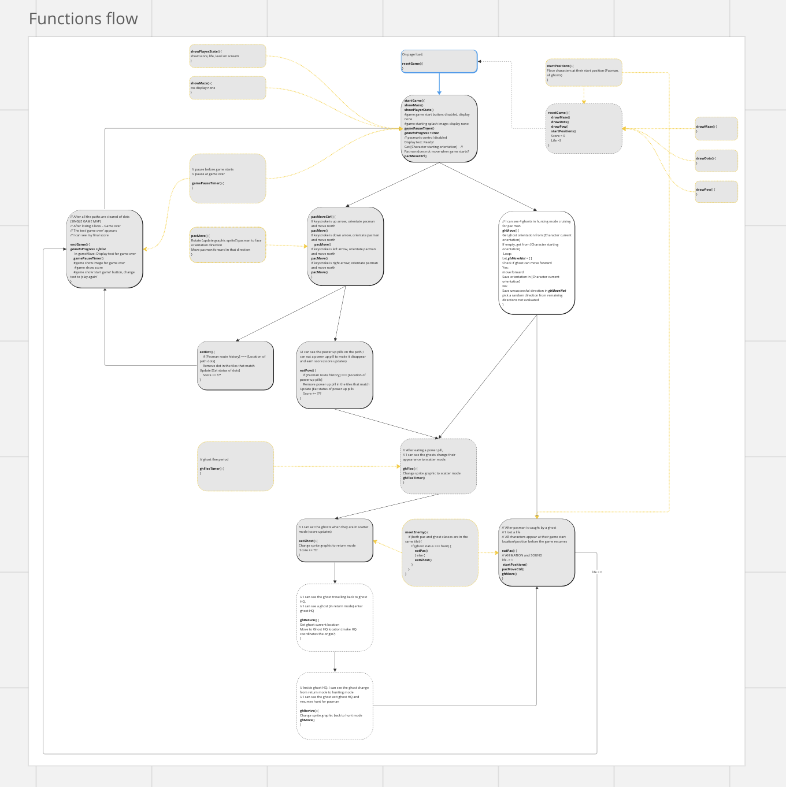
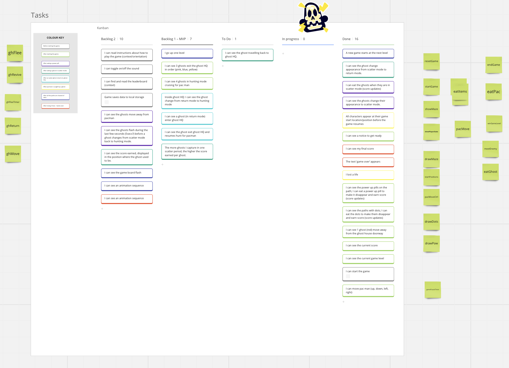

# Description
Browser game based on the original Pacman arcade game.
# Deployment link
https://vvaneli.github.io/pacman/
# Getting Started/Code Installation
Open the index.html file in a web browser
# Timeframe & Working Team
1 week solo project, from planning to completion of requirements.
# Technologies Used
HTML, CSS, JavaScript
# Brief
Project: Build a classic arcade game from scratch using HTML, CSS and JavaScript.
Requirements:
* Game is constructed from a grid of tiles (not HTML Canvas)
* Design logic for winning and visually output the results.
* Uses semantic HTML. Uses JavaScript for DOM manipulation.
* Consider responsive design.
* Runs in a web browser. Deployed online with separate files for HTML, CSS and JS.
# Planning
1. User stories – 45 user stories were identified. These were then edited down to 16  (29 rejected based on time constraints)

2. Wireframes
   
   

3. Pseudocode

4. Define elements

5. Define variables

6. Define functions

7. Function flow diagram
   

8. Kanban board with user stories further prioritised
   
# Build/Code Process
# Challenges
# Wins
# Key Learnings/Takeaways
# Bugs
# Future Improvements
